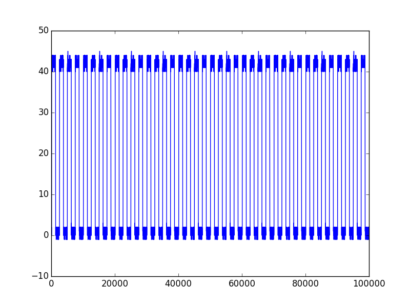

scope-analysis
==============

This project is intended to allow interfacing and data acquisition of data from oscilloscopes and perform analysis on this data.

Here is an example of data captured from a Tektronix DPO 4034B oscilloscope with a 500 Hz wave being fed into channel 1.

